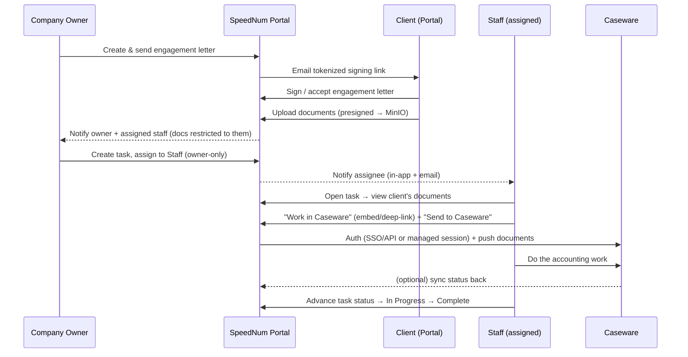

# SpeedNum — Client Engagement → Document → Task → Caseware Workflow Spec

> **Purpose of this document.** This is a feature brief describing an end‑to‑end workflow we want our platform (SpeedNum) to support, and one genuinely new capability we need built: **using Caseware from inside our own portal** instead of sending staff to the Caseware website.
>
> This file is meant to be handed to another assistant (ChatGPT) to produce a **structure + implementation plan**. To make that plan realistic, the doc separates **what already exists in our codebase** from **what needs to be built**, and it flags the **hard technical constraints** around embedding Caseware so the plan doesn't assume something that browsers won't allow.
>
> Tech stack (for the planner): **Backend** = Python + FastAPI + async SQLAlchemy 2.0 + PostgreSQL, object storage on MinIO/S3 (presigned direct uploads). **Frontend** = Next.js 16 (App Router) + React 19 + TypeScript + Tailwind v4. There is **also an Electron desktop build** (`desktop/`) — this matters a lot for Caseware embedding (see §6). Multi‑tenant: one `Tenant` = one accounting firm.

---

## 1. The story we want to support (plain English)

1. A **Company Owner** (the firm owner) sends an **engagement letter** to a **Client**.
2. The **Client accepts/signs** the engagement letter through the **Client Portal**.
3. The Client then **uploads their documents** (financials, receipts, statements, etc.) through the Client Portal.
4. Those uploaded documents become visible to **the Company Owner** and to **only the staff member assigned to that client** — *not* to other staff members in the firm.
5. The Company Owner **creates a task** and **assigns it to a staff member** (an admin/clerk/member) to actually do the accounting work for that client.
6. To do the work, the staff member needs **Caseware** (an external accounting/audit software the firm pays for). The firm owner has **paid Caseware for accounts** and hands out **Caseware credentials** to staff.
7. **The new ask:** instead of the staff member leaving our portal, opening the Caseware website, and logging in there, we want the staff member to **use Caseware from inside our own portal** — log in with their Caseware credentials (provided by the owner), **push the client's uploaded documents into Caseware**, and **start working on the task without leaving our app** (e.g., an embedded Caseware view inside our portal page).

---

## 2. Actors & how they map to our existing system

| Story term | What it actually is in our codebase | Notes |
|---|---|---|
| **Company Owner** | A `Profile` with `role = "owner"` in a `Tenant` | One owner per firm. Always passes every permission check. |
| **Staff member** (admin / clerk / etc.) | A non‑portal `Profile` (`client_id = NULL`) with an enum role (`admin`/`member`/`viewer`) **plus** an optional tenant‑defined named `Role` (e.g. "Clerk") with granular `RolePermission` grants | We do **not** have a literal "clerk" role name — owners create named roles. "Staff" just means any firm user who isn't a client. |
| **Client** | A `Client` row in the tenant | The business the firm serves. |
| **Client Portal login** | A `Profile` whose `client_id` points at that `Client` | Separate login surface (`/dashboard/*`), `noindex`. |
| **"Staff assigned to that client"** | `Client.owner_id` → the assigned staff `Profile` | This is the field that means "this staff member owns/handles this client." |
| **"Task assigned to staff"** | `Task.assignee_id` → the assigned staff `Profile` | Tasks live in "Task Master" (`workflows.py`). |
| **Firm / Company** | A `Tenant` | Multi‑tenant; nearly every table carries `tenant_id`. |

---

## 3. Current state — what ALREADY exists (do not rebuild)

The planner should treat these as **built and working**, and only design the *deltas*.

### 3.1 Engagement letters ✅ (fully built, end‑to‑end)
- Models: `EngagementLetter` + `EngagementLetterItem` (`backend/app/models.py`).
- Flow already works: Owner/staff builds letter → **send** (emails client a tokenized signing link) → client opens public page (status → `viewed`) → client **signs** (captures signature + IP) or **declines** → firm can **counter‑sign**.
- Routers: `backend/app/routers/engagements.py` (firm side), `portal.py` (public token signing, no login), `client_engagements.py` (authenticated portal client). Shared logic in `backend/app/services/engagement_signing.py`.
- Frontend: `frontend/src/app/(firm)/engagements/`, public `frontend/src/app/engagement/[token]`, portal `frontend/src/app/dashboard/engagements/`.
- **Status statuses:** `draft / sent / viewed / signed / declined / void`.

> **Delta needed here:** essentially none for the core flow. Optionally, we may want an event/trigger: "engagement `signed` → unlock document upload / create an onboarding task" (see §5).

### 3.2 Client portal + document upload ✅ (built)
- `Document` model (`backend/app/models.py`): `tenant_id`, `client_id`, optional `letter_id`/`task_id`, `storage_path`, `mime_type`, `size_bytes`, `kind`, **`is_client_visible`**, `uploaded_by`.
- Upload = **presigned direct‑to‑storage** (browser PUTs bytes straight to MinIO; API only mints the URL and later registers metadata). Two steps: `POST …/upload-url` → PUT to MinIO → `POST …` to register.
- Portal side: `backend/app/routers/client_documents.py` (`/client-portal/documents`). A portal user sees files where `is_client_visible = True` OR they uploaded it; their own uploads are forced visible.
- Firm side: `backend/app/routers/client_documents_staff.py` (`/clients/{client_id}/documents`).
- Frontend: `frontend/src/app/dashboard/documents/` (client), firm document views under `(firm)`.

### 3.3 Owner → staff task assignment ✅ (built — recent commit `3aed227`)
- `Task` model has `assignee_id`, `client_id`, `status`, `task_type`. Router: `backend/app/routers/workflows.py`.
- **Task creation/assignment is already Owner‑only** (`POST /tasks` rejects non‑owners: *"Only the company Owner can create tasks."*).
- A plain staff member can change **only `status`**, and **only on a task assigned to them** — this is the "Start work" path (`To do → In Progress → Complete`). Logic in `backend/app/permissions.py` (`is_firm_owner`, `can_update_task_fields`). Assignee gets an in‑app + email notification.
- Per‑assignee timers exist (`TaskTimer`, `task_timers.py`).

### 3.4 Client ↔ staff scoping ✅ (partly built — see the gap in §4)
- A role lacking `clients.view_all` is restricted to clients where `Client.owner_id == self` via `permissions.client_owner_clause()`. This clause **is** applied to clients, projects, tasks, client‑services, and invoices listings.

### 3.5 What is NOT built / is only placeholder
- **No Caseware integration of any kind.** ← the core of this spec.
- **No iframe / embedded‑external‑app anywhere** in the product today.
- **Google Workspace (Calendar/Drive/Gmail) integrations are placeholder UI only.** Google OAuth exists **for login SSO only**. So there is no existing "connect a third‑party account and store its tokens per user" plumbing to copy — it must be designed.
- The **Integrations page** (`frontend/src/app/(firm)/integrations/`) exists as a shell; only email transport is real.

---

## 4. Gap #1 — restrict client documents to "owner + assigned staff only"

The story requires: *"the document will show to the company owner and only the staff assigned to that client, not other staff members."*

**Today this is NOT enforced at the document layer.** `backend/app/routers/client_documents_staff.py` (`GET/POST/DELETE /clients/{client_id}/documents`) only checks that the client belongs to the tenant (`ensure_client_in_tenant`). It does **not** apply `client_owner_clause`, so *any* firm staff member who has a `client_id` can list/upload/download/delete that client's documents, regardless of assignment.

**Delta needed:**
- Apply the same `client_owner_clause` (owner + `Client.owner_id == self` + `clients.view_all` override) to **all** document endpoints in `client_documents_staff.py` and `task_attachments.py`.
- Result: Owner sees all; assigned staff sees their clients' docs; unassigned staff get 403/404.
- Decide behaviour for a staff member assigned via **task** but not via `Client.owner_id` (e.g., owner assigns a one‑off task to a clerk who doesn't "own" the client). Options: (a) grant document access for the duration of an active assigned task, or (b) require the owner to set `Client.owner_id`. **This is an open question for the planner (see §9).**

---

## 5. Gap #2 — workflow glue (engagement → documents → task)

Individually the pieces exist; we want them to chain:
- On engagement `signed`, optionally: enable portal document upload for that client and/or auto‑create an "Onboarding / collect documents" task.
- When the client uploads documents, notify the Owner + assigned staff (we already have a notifications system + email).
- The Owner creates the accounting task and assigns it (already Owner‑only).
- The assigned staff opens the task → sees the client's uploaded documents (subject to §4) → proceeds to Caseware (§6).

This is light orchestration/eventing, not new subsystems.

---

## 6. Gap #3 (the core ask) — using Caseware from inside our portal

**Goal:** a staff member, working on an assigned task inside SpeedNum, can (a) authenticate to Caseware with credentials the Owner provisioned, (b) push the client's uploaded documents into Caseware, and (c) do the work — **without leaving our portal / re‑typing credentials on the Caseware website.**

This is the part that needs the most careful design because of **browser security constraints**. The planner MUST account for the following realities rather than assuming a naive iframe will work.

### 6.1 First unknown to resolve: WHICH Caseware product?
Caseware is not one app. The integration approach depends entirely on this:

| Product | Nature | Can it be embedded / API'd? |
|---|---|---|
| **Caseware Cloud** (`cloud.caseware.com`) | Web app | Has a **REST API** + SmartSync. Embedding depends on their frame headers (see 6.2). This is the only browser‑embeddable option. |
| **Caseware Working Papers** | **Windows desktop app** | **Cannot be embedded in a web page at all.** Integration would be file/API sync only, or automation on the desktop. |
| **Caseware IDEA** | Desktop data analysis | Same — not web‑embeddable. |

> **Action for planner/user:** confirm the exact Caseware product/edition the firm uses, and whether their Caseware plan exposes a **public API and/or SSO (SAML/OAuth)**. Everything below branches on this.

### 6.2 Why "just iframe the Caseware website and auto‑fill the login" usually does NOT work in a browser
- **Frame‑busting headers.** Most SaaS apps (very likely Caseware Cloud) send `X-Frame-Options: DENY/SAMEORIGIN` or CSP `frame-ancestors 'self'`. When present, **our site cannot embed theirs in an iframe** — the browser blocks it, and there is nothing we can do from our side to override it.
- **Same‑Origin Policy.** Even if framing were allowed, a **cross‑origin** iframe is a black box: our JavaScript **cannot read or write** the embedded page's DOM, so we **cannot auto‑type the staff's Caseware username/password** into their login form. Auto‑login into a cross‑origin iframe is not possible with normal web tech.
- **Terms of Service & security.** Storing a third‑party's username/password and replaying it to auto‑login is generally against the third party's ToS and is a security anti‑pattern.

**Conclusion:** the clean, portable version of this feature is **not** "iframe + inject password." It is one of the approaches below.

### 6.3 Realistic approaches (the planner should pick/combine)

**Option A — Caseware Cloud REST API + SSO deep‑link (recommended if Caseware Cloud + API available).**
- Server‑to‑server: authenticate to Caseware via its API (OAuth client creds / API token per firm), **push the client's uploaded documents** from our MinIO storage into the correct Caseware file/entity programmatically.
- For the staff to "work," **deep‑link** them into Caseware Cloud (open in a new tab) using **SSO** (SAML/OAuth) if the firm has it, so they land already authenticated — no password typed, no iframe needed.
- Pros: clean, secure, ToS‑friendly, no credential storage. Cons: requires Caseware API/SSO to exist on their plan; not literally "inside our page" (opens a tab), though document sync is fully inside our app.

**Option B — Embedded iframe (ONLY if Caseware supports it).**
- Feasible **only if** Caseware Cloud allows our origin in `frame-ancestors` **and** provides an **embed/SSO token** (so login happens via a token we're allowed to pass, not by injecting a password). This typically requires Caseware's cooperation / a partner arrangement.
- If both are true, embed the Caseware view in our task page and sync documents via the API (Option A plumbing).

**Option C — Electron desktop app "webview" with managed session (this is the realistic way to get the literal "embedded Caseware, auto‑login" experience).**
- **We already have an Electron desktop build (`desktop/`).** Electron is NOT bound by the browser's Same‑Origin restrictions the same way: using a `<webview>`/`BrowserView` with a **partitioned session** and a **preload script**, the desktop app can host the Caseware web app, **manage/persist its session per staff member**, and optionally automate the login. This is where "log in with the credentials the owner gave you, then work inside our app" is actually achievable end‑to‑end.
- Pros: delivers the exact UX described. Cons: desktop‑only (not the web portal), still must respect Caseware ToS, and login automation can be brittle if Caseware changes their login page. Frame‑busting headers can be stripped at the Electron session level, but do so knowingly and within ToS.

**Option D — Server‑side headless automation (fallback only).**
- A server‑side headless browser (e.g., Playwright — already present in this environment) logs into Caseware with stored credentials and uploads the client's files. Use only as a last resort: fragile, higher ToS risk, and requires storing credentials.

### 6.4 Credential handling (if we must store Caseware credentials)
If the chosen approach requires storing the owner‑provisioned Caseware credentials/tokens per staff member:
- Store **encrypted at rest** (e.g., Fernet/AES with a per‑tenant key or KMS), never plaintext, never returned to the frontend.
- Model something like `CasewareCredential` (`tenant_id`, `profile_id` [the staff member], `caseware_username`, `secret_ciphertext`, `provisioned_by` [owner], `created_at`, `revoked_at`). Owner provisions; staff consumes; owner can revoke.
- Prefer **OAuth tokens / API keys** over raw passwords wherever Caseware supports them.

### 6.5 Document push ("client files → Caseware")
Regardless of A/B/C:
- Source of truth for client files is our `Document` rows on MinIO. We need a "**Send to Caseware**" action on a document (or bulk on a task) that transfers the file into the correct Caseware file/engagement/entity.
- Needs a mapping: our `Client` (and maybe `Task`/`EngagementLetter`) ↔ Caseware entity/file id. Model something like `CasewareLink` (`tenant_id`, `client_id`, `caseware_entity_id`, `caseware_file_id`, …).
- Track sync state per document (`pending / synced / failed`) so staff can see what's already in Caseware.

---

## 7. Proposed new data model (sketch for the planner to refine)

```
CasewareConnection        # per-firm connection settings
  id, tenant_id
  product            # 'cloud' | 'working_papers' | ...
  api_base_url, oauth_client_id, oauth_client_secret_ciphertext  # if API/SSO
  status             # 'connected' | 'error' | 'disconnected'
  created_by (owner profile), created_at

CasewareCredential        # per-staff login the owner provisioned
  id, tenant_id, profile_id (staff)
  caseware_username
  secret_ciphertext        # encrypted; may be a password OR an OAuth refresh token
  provisioned_by (owner profile)
  created_at, revoked_at

CasewareLink              # maps our client/task to a Caseware entity/file
  id, tenant_id, client_id, task_id?, engagement_letter_id?
  caseware_entity_id, caseware_file_id
  created_at

DocumentCasewareSync      # push state per document
  id, tenant_id, document_id, caseware_file_id?
  status            # 'pending' | 'synced' | 'failed'
  error_message?, synced_at
```

---

## 8. End‑to‑end sequence (target state)



---

## 9. Open questions for the planner (ChatGPT) to resolve

1. **Which Caseware product & edition?** Cloud vs Working Papers (desktop) vs IDEA. Does the firm's plan expose a **public API** and/or **SSO (SAML/OAuth)**? *(This determines which of Options A–D is even possible.)*
2. Given the browser constraints in §6.2, which target do we build first: **web portal (Option A/B)** or **Electron desktop (Option C)** for the "embedded, auto‑login" experience?
3. For document access (§4): should a staff member assigned a **task** (but not set as `Client.owner_id`) get access to that client's documents for the task's duration, or must the owner set `Client.owner_id`?
4. Credential model (§6.4): are we storing Caseware **passwords** (encrypted) or can we use **API keys / OAuth tokens**? Who rotates/revokes them?
5. Document → Caseware mapping (§6.5): what Caseware object do client files land in (file / entity / engagement), and who creates that mapping — owner or staff?
6. Compliance: any data‑residency / retention constraints on pushing client documents into Caseware, and audit‑logging requirements for who sent what.

---

## 10. Scope summary (what to build vs reuse)

| Area | Status | Work needed |
|---|---|---|
| Engagement letter create → sign → counter‑sign | ✅ Exists | None (maybe add a "signed" trigger) |
| Client portal document upload | ✅ Exists | None |
| Owner‑only task creation/assignment; staff "Start work" | ✅ Exists | None |
| Restrict documents to owner + assigned staff | ⚠️ Gap | Apply `client_owner_clause` to document endpoints (§4) |
| Workflow glue (engagement→docs→task events) | ⚠️ Partial | Light eventing/notifications (§5) |
| **Caseware connection + credentials** | ❌ New | Models + owner setup UI (§6.4, §7) |
| **Push client documents into Caseware** | ❌ New | "Send to Caseware" action + sync tracking (§6.5) |
| **Work in Caseware inside our app** | ❌ New | Pick Option A/B/C/D per §6.3 (embed vs deep‑link vs Electron webview) |

---

*Prepared as a handoff brief. The most important thing for the implementation planner to internalize: the "embed Caseware in an iframe and auto‑type the password" idea does not work in a normal web browser (frame‑busting headers + Same‑Origin Policy). The realistic paths are the Caseware **API + SSO deep‑link** (web) or the **Electron desktop webview with a managed session** (which we already have the desktop shell for). Confirm the Caseware product/API/SSO first — it decides everything.*
