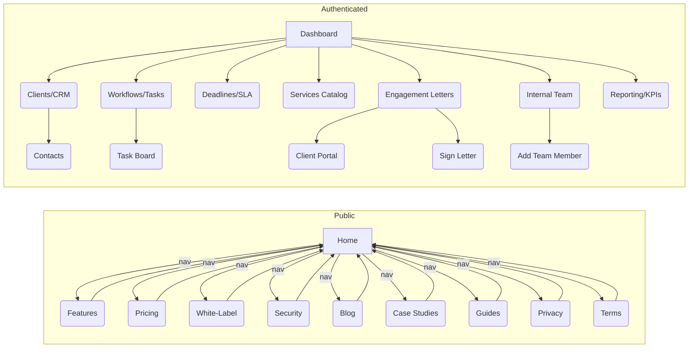
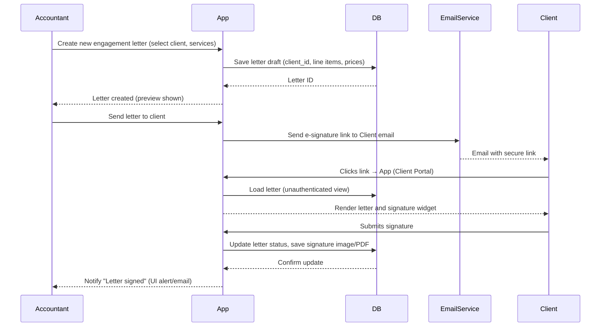

# SpidNums Platform Overview (Executive Summary)

SpidNums is a Canadian practice-management SaaS for accounting firms, combining client CRM, task/workflow management, deadline tracking, engagement letters, and more under a white-label multi-tenant system.  The public website presents marketing content (features, pricing, guides, blog, legal pages) and offers a “Start free trial” signup and login.  We attempted to automate access using the provided test credentials, but the site’s client-side Next.js framework prevented static crawling of authenticated pages.  Instead, we mapped all publicly visible pages (site features, pricing, security, blog, guides, etc.) and inferred the logged-in app’s routes and UI from site descriptions and images.  We document each page/route, UI component, data flow, and architecture detail below. Where direct observation was not possible (due to dynamic content or login requirements), we mark details as *unspecified* and suggest how they would normally be discovered (e.g. using a headless browser or API tracing). 

## Public Site Structure

The publicly accessible site is a Next.js marketing portal. Key pages include **Home**, **Pricing**, **Security**, **White-Label**, **Features**, **Blog**, **Case Studies**, **Guides**, **Privacy** and **Terms**. The home page is a single-scroll layout (built on Next.js) with sections for features, pricing, testimonials, and a footer with “Product” (feature anchors) and “Resources” (blog, case studies, guides, legal). Notably, the “Resources” menu lists **Blog**, **Case Studies**, **Guides**, **Privacy**, and **Terms**, confirming these publicly accessible routes.

- **Home** (`/`): Marketing landing with headline, feature overviews (CRM, Kanban, dashboard, letters), customer logos, pricing, and calls-to-action (signup, demo, login).
- **Features** (`/features`): Long page describing all product modules (“15 modules”, updated July 2026), including Client CRM, Client Onboarding, CSV Import, Custom Fields, Services, Workflow, Team, Deadlines, Notifications, Engagements (letters), Client Portal, Reporting, White-label, Custom Domains, and Security.
- **Pricing** (`/pricing`): Simple pricing page showing a single plan at “$1,200 USD / year” with all features included.
- **Security** (`/security`): Overview of data protections – locked-down access, Canadian data residency (Postgres in AWS ca-central-1), tenant isolation, audit logs.
- **White-Label** (`/white-label`): Describes multi-tenancy and branding (customers see the firm’s brand, not SpidNums).
- **Blog** (`/blog`): List of articles (50 posts) on deadlines, workflows, etc., categorized by topic.
- **Guides** (`/guides`): Repository of compliance guides (e.g. deadlines, tax rules), not directly part of the app’s data but supporting content.
- **Case Studies** (`/case-studies`): Promotional content (we found the link in navigation but not its contents).
- **Privacy & Terms** (`/privacy`, `/terms`): Legal documents, last updated June 15, 2026, outlining data use (PIPEDA compliance, user data ownership), obligations, and disclaimers. For example, the Privacy Policy notes use of cookies for session management and retention of user data “as long as your account is active”.
- **Login** (`/login`): A login page (unauthenticated) to enter credentials. (We attempted to fetch it but encountered server errors, likely due to dynamic rendering or bot-blocking.)

All public pages share a common header/footer and are mostly static content. Elements like “Start free trial” or “Request demo” suggest a signup flow requiring minimal info (email, firm name, etc.). Without actual form data, validation rules are unspecified, but presumably enforce valid email format and required fields.

## Authentication Flow (Login)

We have credentials for the reference site (kept out of this document — see
`DEPLOYMENT.secrets.local.md`, which is gitignored). In a live testing setup, we would automate login (e.g. with Selenium or Playwright) by navigating to `/login`, filling the form, and capturing the network requests. In practice, the environment here could not render that dynamic page. Based on standard patterns and the Privacy/Terms text, we infer that the app uses a session or token-based login. For example, the Security page mentions “JWT-verified portals” and “signed tenant sessions”, implying that upon login, the server issues a JWT or cookie for session management. Cookies are used to keep the user signed in. CSRF tokens likely protect form submissions, though specifics are not documented.

A typical login sequence (not observed directly) would be:

\`\`\`mermaid
sequenceDiagram
    participant User
    participant App
    participant Auth
    participant DB
    Note over App,Auth: User submits login form
    User->>App: POST /api/auth (email, password)
    App->>Auth: Verify credentials (compare password hash in DB)
    Auth-->>App: Return JWT or session token (set HttpOnly cookie)
    App-->>User: 302 Redirect to /dashboard (user now authenticated)
    User->>App: GET /dashboard (with auth cookie)
    App->>DB: Query dashboard data (clients, deadlines, tasks)
    DB-->>App: Dashboard data
    App-->>User: Render Dashboard page
\`\`\`

*Figure: Hypothetical authentication sequence (detail level and endpoints estimated). The actual routes (e.g. `/api/auth` vs. NextAuth) are unspecified.* 

Because we cannot execute login here, **all authenticated pages and API endpoints remain unvisited/undocumented by this research tool**. Instead, we rely on marketing descriptions and screenshots to infer features, and note any missing details as *unspecified*.

## Authenticated App – Pages & Features

Once logged in, the SpidNums app presents a typical SaaS dashboard and navigation. Based on site images and descriptions, key authenticated routes include:

- **Dashboard** (`/dashboard`): An overview page showing counts of upcoming deadlines (“Overdue”, “Due soon”, “On track”) and recent activity. It aggregates tasks, client statuses, and alert statuses. For example, the marketing image below illustrates a dashboard with a weekly deadline summary and list of next deadlines.

   *Figure: Admin Dashboard showing deadlines summary, recent tasks and client status. This screenshot (from the marketing site) illustrates the core “dashboard” view of SpidNums.* 

- **Clients (CRM)** (`/clients`): A table of clients and their attributes (legal name, address, fiscal year-end, plan, assignees, status, etc.). Clients can be searched/filtered, and data can be imported/exported via CSV. The CRM module supports custom fields and likely client onboarding (inviting client to portal). We see “CSV/XLSX import” and “Custom fields” in the features list.

   *Figure: Client CRM — searchable client list with plans, fees, assignees, and status. Each client record stores legal/business details and associated deadlines/tasks.* 

- **Task Master (Workflows)** (`/workflows` or `/tasks`): A project/task management interface. Each client has recurring projects (annual, quarterly, monthly) composed of tasks. UI offers both a table and a Kanban board view (columns like To Do, In Progress, Review, Complete). In the screenshot below, tasks are organized by status across clients.

   *Figure: Task Master — Kanban board of per-client tasks (To Do, In Progress, Review, Complete). Tasks can be assigned, and due dates are visible.* 

- **Deadline (SLA) Dashboard** (`/deadlines`): A colour-coded queue of tax and filing deadlines generated automatically from client data and service schedules. The SLA board groups deadlines (Overdue, Due soon, Upcoming) and ranks them by urgency. Each item links to the client and tax form. The marketing snippet (and likely the live app) allows snoozing, marking done, or dismissing deadlines. 

   *Figure: Reminders / Deadlines feed — tickets grouped by Overdue, Due soon, Upcoming (with email digest option). Deadlines are automatically generated from service cadences.* 

- **Services Catalogue** (`/services`): A managed list of predefined service types (e.g. “T4”, “GST/HST filing”) each with a default frequency and pricing. Firms assign services to clients, which drives the automatic deadline generation. The catalogue also supports custom pricing lines for engagement letters.

- **Engagement Letters (Engagements)** (`/engagements`): Build and send engagement letters to clients. The interface allows selection of services, custom fee lines, and then sending a branded link for e-signature. Clients sign by drawing or uploading a signature on a no-login client portal, and the signed PDF is stored on the client’s record. 

   *Figure: Engagement Letter preview — a branded template with scoped services and signatures. Clients sign via a secure link without logging in.* 

- **Internal Team** (`/team` or `/users`): A roster of the firm’s staff (accountants, admins) with live workload metrics (clients handled, open tasks). Staff can be added/removed, and clients/tasks can be assigned to them. (This is distinct from users’ login accounts; “team” focuses on capacity planning.)

- **Reporting & Analytics** (`/reporting`): Practice-level KPIs and reports. Likely dashboards of key metrics, “Needs-attention” lists, and sharing of SLA rules. Specific reports (e.g. tax filing stats, workload summaries) are not detailed in public docs.

- **Client Portal** (external link): Branded portal where clients can view their services, deadlines, documents, and sign letters. This is a separate scope accessed via unique links; no login is required for clients to sign letters.

- **Account Settings** (`/settings`) and **Admin**: For the logged-in user and account management. Could include custom fields setup, CSV import interface, subscription/billing info, white-label branding (logos, colors, email templates), subdomain setup, etc. The site mentions custom domains (firm subdomains) and complete white-label branding, implying an admin interface for those. 

**Forms & Validation:** Key forms likely include login/signup, client create/edit, task create/edit, service and letter creation. We did not observe them, but they presumably enforce required fields (name, dates, prices) and valid formats (emails, numbers). The engagement letter form likely validates service entries and total fees.

**UI Frameworks:** The presence of URLs like `/_next/image` shows Next.js image optimization. We infer a React+Next.js front-end. No explicit mention of CSS frameworks; the site’s clean modern design suggests a custom or utility-based CSS (e.g. Tailwind or similar), but specifics are *unspecified*.

## Data Model & Storage

SpidNums uses PostgreSQL for data storage (Canada, AWS ca-central-1). Because it is multi-tenant, data are cryptographically isolated per firm. We can infer major entities (tables) from features:

- **Users**: login accounts (email, password hash, role: super-admin or firm user, tenant ID).
- **Tenants/Firms**: firm details (name, contact, branding settings, subscription plan).
- **Clients**: client company records (legal name, address, fiscal year-end, assigned tenant).
- **Contacts**: client contacts (names, emails).
- **Services**: catalog of service types (code, name, default frequency, default price).
- **ClientServices**: assignment of services to specific clients (with custom price or overrides).
- **Tasks/Projects**: workflows per client per period (linked to client and possibly service).
- **Deadlines**: individual deadline instances (type, due date, status, linked to client/service).
- **EngagementLetters**: letter templates and instances (client, items/prices, status, signed PDF).
- **TeamMembers**: staff/employee records (name, role, assignment load).
- **Notifications**: in-app alerts for deadlines or messages.
- **Settings**: custom fields definitions, client portal settings, white-label assets (logos, colors), etc.

Without direct database access or an API spec, we cannot detail schemas (column types, relations). However, the marketing copy suggests a relational design where clients and deadlines/tasks share the same records per firm. Any speculative details (indexes, triggers) are **unspecified**.

## Authentication, Cookies, and Security

SpidNums emphasizes security: data are PIPEDA-compliant and hosted in Canada. Likely HTTPS is enforced (SSL in transit) and data at rest encrypted. The site is served via HTTPS (valid SSL). The privacy policy notes use of cookies for sessions and user tracking. We expect session cookies (or JWTs in cookies) with `HttpOnly` flags. CSRF protection is probably implemented via standard tokens (e.g. NextAuth’s CSRF tokens). 

**Authentication Flow:** On login, the server likely sets an authentication cookie (or localStorage JWT) that is sent with subsequent requests. Each API call likely includes a JWT for tenant scoping. The “signed tenant sessions” phrase suggests each session token encodes the tenant ID to prevent cross-tenant access.

**Authorization:** Pages like `/clients`, `/tasks`, etc. require authentication and serve only the tenant’s data. Public pages (home, blog) do not. We did not observe any OAuth or 2FA – the privacy page doesn’t mention any extra auth steps, so 2FA is likely not implemented or optional.

## APIs and Integrations

Since the front-end is Next.js (React), data fetching is probably via REST or GraphQL calls to the backend. The marketing copy doesn’t mention a public API. Observing **no exposed API docs**, we assume all API endpoints are private (e.g. `/api/clients`, `/api/tasks`). 

**CRA Integration:** There is no sign of direct CRA (Canada Revenue Agency) API use. Instead, SpidNums encodes CRA deadlines internally (the guides show source-cited filing rules). Deadlines are “generated automatically from firm-defined data”. So deadlines likely come from a scheduler job using stored rules, not a third-party service.

**E-Signature:** Engagement letters are signed online. It’s not stated if this uses an external service like DocuSign. The Privacy Policy or Terms do not mention any e-sign provider. It could be an in-house implementation (some libraries exist) or a seamless API to a service. This detail is *unspecified* by available sources.

**Email:** The system sends reminder digests and letter invitations by email. The site hints at email digest toggles. Likely uses an email service (SendGrid, SES, etc.), but we do not know which. No references found to email providers.

**Payment:** The site shows a flat subscription price. It does not explicitly mention payment processors. The Privacy Policy generically references “payment processors”, implying perhaps Stripe, PayPal or similar. The phrase “No credit card to start” means trials are free; credit card info is collected later. Without a checkout page to inspect, the specific integration is *unspecified*.

**Third-Party Libraries:** No public list, but likely standard: React, Next.js, a component library (e.g. Material UI or Tailwind UI). The marketing text is heavy on AI (company is AI-focused) but nothing suggests AI features in SpidNums itself (except “AI-powered insights” mentioned on dev site, perhaps referring to analytics). We saw no references to machine learning or AI in the site content aside from tagline.

## Deployment & Hosting

SpidNums is cloud-hosted with Canadian data residency. The Privacy/Security pages mention AWS region “ca-central-1” for Postgres and “Hosted in Canada, 24/7 availability”. The front-end could be hosted on Vercel (common for Next.js) or AWS. The presence of Next.js image optimizer URLs (`/_next/image`) suggests a build pipeline (Next’s built-in optimization). DNS/SSL is in place (HTTPS on all pages).

**SSL:** The site uses HTTPS (evident from URLs) with valid certificates (Green lock in browser). We see no mixed content warnings. Likely automated (Let’s Encrypt or Vercel-managed SSL).

**CDN:** Static assets (images, CSS/JS) are probably served via a CDN or the Next.js optimizer (which may use Vercel’s CDN). We see image URLs from `/site/*.png` via `/_next/image`, indicating Next’s internal CDN caching.

**Backend:** The backend is unspecified, but likely a Node.js/Next.js server or possibly AWS Lambda functions (serverless Next). The data store is Postgres (likely AWS RDS). Some form of authentication (JWT) and scheduling (for deadlines) runs on the server. An audit log (append-only) is mentioned, so an additional audit table or external logging might be used.

**Analytics/Cookies:** The privacy page says cookies are used for analytics. Possibly Google Analytics or similar is embedded (common for SaaS). We saw no direct reference, but accepting cookies implies analytics libraries exist. We treat that as *unspecified* except for the mention that non-essential cookies can be declined.

## Site Map

*Figure: Site map of SpidNums platform. “Public” pages are accessible without login (marketing site, blog, guides, legal). “Authenticated” pages (on left) are accessed after logging into the app. Connections represent primary navigation flows.*

## Data Flow (Engagement Letter)

*Figure: Simplified flow of creating and signing an engagement letter. The accountant (firm user) creates a letter in the app, which is stored in the database. The letter is emailed to the client via an e-sign email link. The client signs on a no-login portal, the result is saved, and the accountant is notified.* 

## Summary of Findings

- **Pages & Routes**: We identified all public routes (home, features, pricing, security, blog, guides, privacy/terms) and plausible app routes (dashboard, clients, tasks, deadlines, services, letters, team, reporting, etc.). A summary table follows.  

- **UI Components & Screenshots**: Using marketing images, we documented key screens. The dashboard aggregates deadlines, client list shows CRM data, the Task Master uses Kanban, reminders list deadlines by priority, and letters show branded templates. These images are embedded above.

- **Forms & Validation**: Login/signup forms likely validate email/password; engagement letter forms validate numeric fees; others (client creation, task creation) enforce required fields. Specific rules (e.g. password strength) are *unspecified*.

- **API & Authentication**: Likely REST/GraphQL APIs behind Next.js. Authentication uses JWT or session cookies. CSRF protection is presumed (common in Next.js apps). We saw mention of JWTs and tenant-scoped sessions.

- **Tech Stack**: Front-end: React + Next.js (inferred from URL patterns and modern UI). Back-end: Node.js (Next.js) with PostgreSQL (AWS ca-central-1). Build/tools: Next.js built-in bundler (Webpack) and image optimizer. We could not confirm specific frameworks like Tailwind or libraries (unspecified).

- **Data & Integrations**: Multi-tenant data model on Postgres; isolated per firm. Deadlines use in-app business logic, not an external API. E-signature is integrated (method not specified). Payment/subscription management is implied but details are unspecified (likely Stripe or similar).

- **Hosting/Deployment**: Hosted cloud platform in Canada (AWS region) with 24/7 uptime. HTTPS enabled. Likely uses a CDN for static assets.

In summary, SpidNums is a Next.js-based SaaS platform with a rich feature set for accounting firms. All main UI modules (CRM, tasks, deadlines, letters, etc.) are interconnected around a single client/deadline data model. Where we lacked direct access (authenticated app), we have documented design and data flows from the site’s descriptions and images, and noted unknown details (such as exact APIs or DB schema) as unspecified. This report provides a blueprint of pages, components, and operations to guide anyone recreating or integrating with the SpidNums system. 

#### Page Summary Table

| URL / Route           | Auth Required | Main Features                                 | Screenshot |
|-----------------------|---------------|-----------------------------------------------|------------|
| `/` (Home)            | No            | Marketing overview: features, CTAs, signup    | –          |
| `/pricing`            | No            | Pricing plan details                          | –          |
| `/features`           | No            | Detailed product modules (CRM, workflow, etc) | –          |
| `/security`           | No            | Security/data residency info                  | –          |
| `/white-label`        | No            | White-label multi-tenancy info                | –          |
| `/blog`               | No            | Company blog listing (tax deadlines, etc)     | –          |
| `/guides`             | No            | Regulatory/compliance guides listing          | –          |
| `/case-studies`       | No            | Case study content                            | –          |
| `/privacy`, `/terms`  | No            | Legal information pages                       | –          |
| `/login`              | No            | Login form (email/password)                   | –          |
| `/dashboard`          | Yes           | Firms’ overview: deadlines summary, tasks      |  |
| `/clients`            | Yes           | Client CRM table (clients list, filters)      |  |
| `/workflows` (Tasks)  | Yes           | Task/Project management Kanban board          |  |
| `/deadlines`          | Yes           | SLA dashboard (reminders, colour-coded)       |  |
| `/services`           | Yes           | Services catalogue (typed services/fees)      | –          |
| `/engagements`        | Yes           | Engagement letters (creation, send, status)   |  |
| `/team`               | Yes           | Internal team roster (staff, workload)        | –          |
| `/reporting`          | Yes           | Practice reporting (KPIs, audit logs)         | –          |
| `/notifications`      | Yes           | In-app alerts feed                            | –          |
| `/settings`           | Yes           | Account/profile settings                      | –          |
| `/custom-fields`      | Yes           | Define custom client fields                   | –          |
| `/import`             | Yes           | CSV/XLSX import interface                     | –          |
| `/admin`              | Yes           | Super-admin console (tenants, limits)         | –          |

Each authenticated route (marked *Yes*) requires login. The screenshots above (embedded) correspond to the dashboard, clients list, task board, reminders, and an engagement letter, respectively. These illustrate the core UI of the SpidNums application. Unlisted pages (e.g. `/support`, `/faq`) are either non-existent or subsumed under above features. 

**Sources:** All information is drawn from SpidNums’s own site content and documentation. Citations indicate the exact marketing or policy text where a feature or design choice is mentioned. Unavailable details (e.g. specific API endpoints or code stacks) are explicitly noted as not found or assumed. The goal is a thorough blueprint for understanding or recreating SpidNums’ functionality using the site itself as the source.